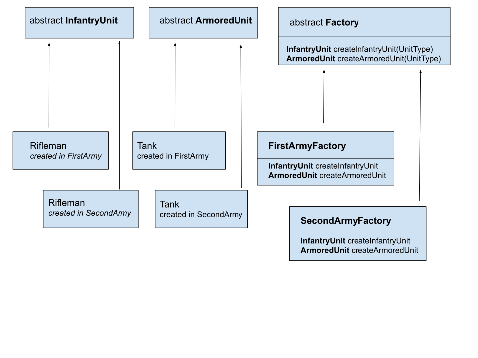

# Introduction

**Abstract Factory** is the second pattern of two kinds of the **Factory pattern**. The first type is **Factory Method**.
The **Abstract Factory** pattern is used to simplify the creation of new objects. Compared to **Factory Method** in the pattern called **AbstractFactory** we can have several factories.

# Flow diagram


Compared to previous pattern we have two or more abstract Unit types. We have for example **Armored Unit** or **Infantry Unit**.
Compared to previous pattern we have two or more implementation of abstract **Factory** class. For example we can see **FirstArmy** and **SecondArmy**.
Each of these factories can create units in different ways and with different characteristics.
For example, we can create Artillery units like this:
````
   @Override
    public ArtilleryUnit createArtilleryUnit(UnitType unitType) {
        switch (unitType){
            case ARTILLERY:
                return new Artillery(ARTILLERY_HP.getValue(), ARTILLERY_EXP.getValue(), ARTILLERY_DAMAGE.getValue());
            case ROCKET_ARTILLERY:
                return new RocketArtillery(ROCKET_ARTILLERY_HP.getValue(), ROCKET_ARTILLERY_EXP.getValue(), ROCKET_ARTILLERY_DAMAGE.getValue());
            default:
                throw new UnsupportedOperationException("Unknown unit type");
        }
    }
````
So we can produce tanks in FirstArmy and SecondArmy and those units may be different.
  
# Benefits and disadvantages using Factory pattern
## Benefits
It encapsulates the creation of new objects so that We do not have access to specific stats of the created objects

## Disadvantages
Abstraction, which can be both an advantage and a disadvantage. By adding more abstract layers it may be more difficult to analyze how the entire app works.

# When Factory pattern can be applied
You can use this pattern when 
- when you have to repeat the operation of creating new objects.
- when you have a to use an external system and you don't know much about the way it is created.
- when the creation an object is complicated and provided construct will not create object in the way you would like to.

# Occurrence
**Abstract Factory** can be used for example while **scripting and JDBC API**.
We can see this pattern in java.sql interfaces and all their concrete implementations from JDBC JAR when driver is registered.
In java core we can see this pattern in
- DatagramSocketImplFactory,
- PreferencesFactory, 
- javax.xml.parsers.DocumentBuilderFactory#newInstance(),
- javax.xml.transform.TransformerFactory#newInstance(),
 -javax.xml.xpath.XPathFactory#newInstance(),

# Sample article
https://www.baeldung.com/java-abstract-factory-pattern

# Youtube

[](http://www.youtube.com/watch?v=v-GiuMmsXj4)