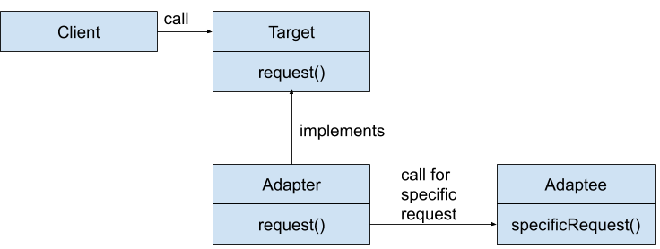

# Adapter Pattern

Adapter Pattern (also known as wrapper) is design pattern that allows the interface of an existing class to be used as another interface. 
It is often used to make existing classes work with others without modifying their source code. 

An adapter allows two incompatible interfaces to work together. This is the real-world definition for an adapter. Interfaces may be incompatible, but the inner functionality should suit the need. The adapter design pattern allows otherwise incompatible classes to work together by converting the interface of one class into an interface expected by the clients.

An example is an adapter that converts the interface of a Document Object Model of an XML document into a tree structure that can be displayed.

An adapter can be used when the wrapper must respect a particular interface and must support polymorphic behavior. Alternatively, a decorator makes it possible to add or alter behavior of an interface at run-time, and a facade is used when an easier or simpler interface to an underlying object is desired.

### What problems Adapter design pattern solves?

Adapter Pattern describe how to solve recurring design problems to design flexible and reusable object-oriented software, that is, objects that are easier to implement, change, test, and reuse.

The adapter design pattern solves problems like:
* How can a class be reused that does not have an interface that a client requires?
* How can classes that have incompatible interfaces work together?
* How can an alternative interface be provided for a class?

Often an (already existing) class can't be reused only because its interface doesn't conform to the interface clients require.

The adapter design pattern describes how to solve such problems:
* Define a separate `adapter` class that converts the (incompatible) interface of a class (`adaptee`) into another interface (`target`) clients require.
* Work through an `adapter` to work with (reuse) classes that do not have the required interface.

The key idea in this pattern is to work through a separate `adapter` that adapts the interface of an (already existing) class without changing it.

Clients don't know whether they work with a `target` class directly or through an `adapter` with a class that does not have the `target` interface.

### Flow diagram

**Client:** in tests

**Target:** LightningToMicroUSB

**Adapter:** LightningToMicroUSBAdapter

**Adaptee:** MicroUSBDevice

### YouTube link

