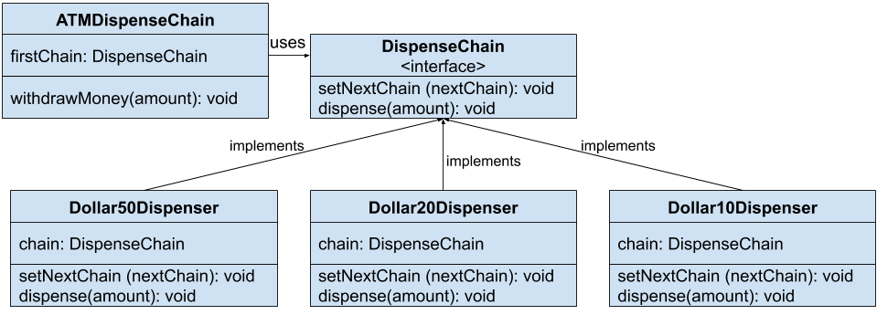
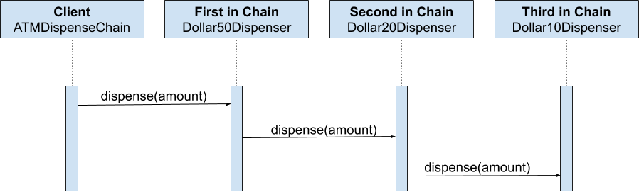

# Chain of Responsibility

Chain of Responsibility pattern is a design pattern consisting of a source of command objects and a series of processing objects. Each processing object contains logic that defines the types of command objects that it can handle; the rest are passed to the next processing object in the chain.
 runtime. A mechanism also exists for adding new processing objects to the end of this chain. 
 
Thus, the chain of responsibility is an object oriented version of the `if ... else if ... else if ....... else ...` idiom, with the benefit that the condition–action blocks can be dynamically rearranged and reconfigured at runtime.
 
Chain of Responsibility describe common solutions to recurring design problems when designing flexible and reusable object-oriented software, that is, objects that are easier to implement, change, test, and reuse.

**What problems can the Chain of Responsibility design pattern solve?**
* Coupling the sender of a request to its receiver should be avoided.
* It should be possible that more than one receiver can handle a request.

Implementing a request directly within the class that sends the request is inflexible because it couples the class to a particular receiver and makes it impossible to support multiple receivers.

**What solution does the Chain of Responsibility design pattern describe?**
* Define a chain of receiver objects having the responsibility, depending on run-time conditions, to either handle a request or forward it to the next receiver on the chain (if any).

This enables to send a request to a chain of receivers without having to know which one handles the request. The request gets passed along the chain until a receiver handles the request. The sender of a request is no longer coupled to a particular receiver.

### Flow diagram

### Sequence diagram

