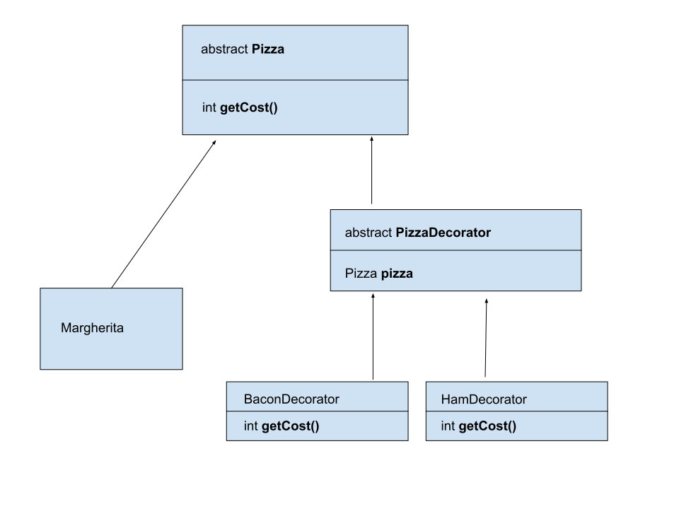

# Introduction

**Decorator pattern** is used to dynamically extend the responsibility of a certain class.

# Flow diagram

The **Decorator pattern** consists of four elements.
The first element is the abstract **Pizza** class. This class is extended by another classes.
The second element are the classes that extend the abstract **Pizza** class. On the diagram it is **Margeritta** class. This is a specific implementation of the Pizza class.
The third element is the abstract class **Pizza Decorator**  which is expanded by specific decorators.
The ***decorators*** are the fourth element. They will decorate **Margeritta** class objects. They do this by implementing **getCost()** method.
    
````
public class BaconDecorator extends PizzaDecorator {
    public BaconDecorator(Pizza pizza) {
        super(pizza);
    }

    @Override
    public int getCost() {
        return pizza.getCost()+4;
    }
}

````
The cost of pizza will be calculated in such a way that the price of the standard version of Margeritta, declared during the creation of the Margeritta object, will increase by 4.

````
Pizza myPizza=new OlivesDecorator(new HamDecorator(new MushroomsDecorator(new Margeritta("margeritta",15))));
        System.out.println("Your order is "+myPizza.getCost());
```` 

The example above shows the ingredients added to Margeritta. Adding some ingredient costs a certain unit number.
 
At the end we can see the price of such decorated pizza. It should be mentioned that the ingredients can be added as many times as you like.
Nothing cant stop you from adding another type of pizza other than Margeritta.
The **Decorator pattern** is suitable to use in a pizza restaurant application. 
# Benefits and disadvantages using Factory pattern
## Benefits
- the ability to dynamically determine the decoration method during application.
- reduction of the relationship dependency between objects.

## disadvantages
- the number of decorating objects can be very large.

# When Factory pattern can be applied
We can apply the **Decorator**  when we want to attach new behaviors to group of classes.

# Occurrence
- We can see **Decorator** pattern all over the java.io package for example BufferedInputStream can decorate other streams such as FilterInputStream
- All subclasses of java.io.InputStream, OutputStream, Reader and Writer have a constructor taking an instance of same type.
- java.util.Collections, the checkedXXX(), synchronizedXXX() and unmodifiableXXX() methods.
- javax.servlet.http.HttpServletRequestWrapper and HttpServletResponseWrapper
- javax.swing.JScrollPane

# Sample article
https://www.baeldung.com/java-decorator-pattern

# Youtube
https://www.youtube.com/watch?v=GCraGHx6gso
[](http://www.youtube.com/watch?v=GCraGHx6gso)