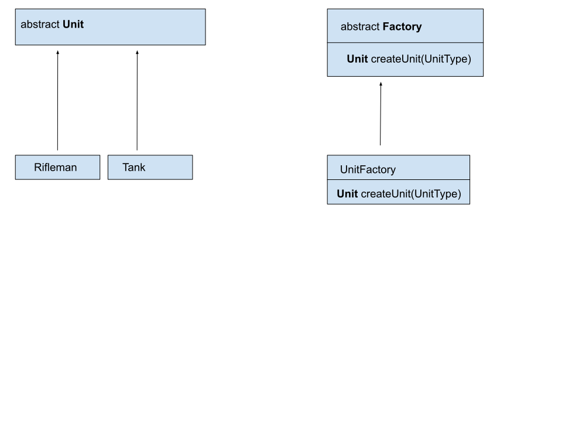

# Introduction

**Factory Method** is the first of two kinds of the **Factory pattern**. The second type is **AbstractFactory**.
The **Factory pattern** is used to simplify the creation of new objects.

# Flow diagram

**FactoryMethod** consists of three parts. The first element is the abstract **Factory class**, which in this case has one method named **createUnit**. This method returns the Unit type.
````
public abstract class Factory {
    abstract public Unit createUnit(UnitType unitType);
}
````
The second element is the specific implementation of the factory named **UnitFactory**. This class implements the **createUnit** method and returns certain objects, for example Tank or Rifleman.
````
 public Unit createUnit(UnitType unitType) {
        switch (unitType) {
            case TANK:
                return new Tank(TANK_HP.getValue(), TANK_EXP.getValue(), TANK_DAMAGE.getValue());
            case RIFLEMAN:
                return new Rifleman(RIFLEMAN_HP.getValue(), RIFLEMAN_EXP.getValue(), RIFLEMAN_DAMAGE.getValue());
            default:
                throw new UnsupportedOperationException("No such unit type");
        }
    }
````
The third element of this pattern is the abstract **Unit** class. It is this class that is extended by classes that define certain military units.
This class can be ommitted in some cases.

# Benefits and disadvantages using Factory pattern
## Benefits
It encapsulates the creation of new objects so that We do not have access to specific stats of the created objects

## disadvantages
Abstraction, which can be both an advantage and a disadvantage. By adding more abstract layers it may be more difficult to analyze how the entire app works.

# When Factory pattern can be applied
You can use this pattern when 
- when you have to repeat the operation of creating new objects.
- when you have a to use an external system and you don't know much about the way it is created.
- when the creation an object is complicated and provided construct will not create object in the way you would like to.

# Occurrence
**Factory Method** can be used for example in **XML factories**.
In jaba core we can see this pattern in
- java.util.Calendar#getInstance()
- java.util.ResourceBundle#getBundle()
- java.text.NumberFormat#getInstance()
- java.nio.charset.Charset#forName()
- java.net.URLStreamHandlerFactory#createURLStreamHandler(String) (Returns singleton object per protocol)
- java.util.EnumSet#of()
 -javax.xml.bind.JAXBContext#createMarshaller() and other similar methods

# Sample article
https://www.baeldung.com/creational-design-patterns

# Youtube
[](http://www.youtube.com/watch?v=EcFVTgRHJLM)