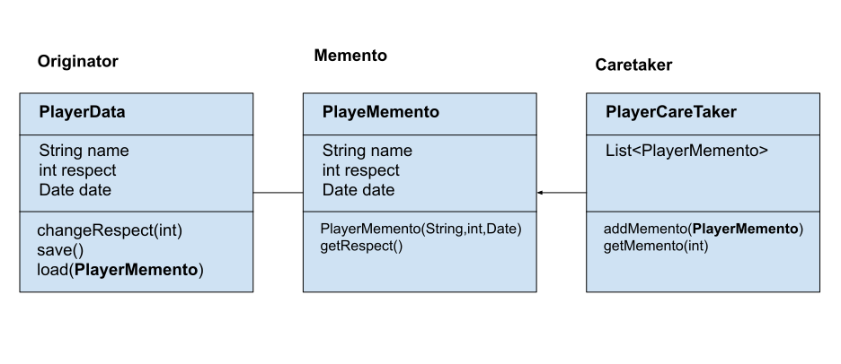

# Introduction
The **Memento Pattern** is a behavioral design pattern. The **Memento Pattern** offers a solution to implement undoable actions. We can do this by saving the state of an object at a given instant and restoring it if the actions performed since need to be undone.
The object whose state needs to be saved is usually called an **Originator**. **The Caretaker** is the object triggering the save and restore of the state, which is called the **Memento**.
The **Memento** object should expose as little information as possible to the **Caretaker**. This is to ensure that we don't expose the internal state of the Originator to the outside world. However, the Originator should access enough information in order to restore to the original state.

# Flow diagram


**PlayerData** class
```
public class PlayerData {
    private String name;
    private int respect;
    private Date date;

    public PlayerData(String name, int respect, Date date) {
        this.name = name;
        this.respect = respect;
        this.date = date;
    }

    public PlayerMemento save() {
        return new PlayerMemento(this.name, this.respect, this.date);
    }

    String load(PlayerMemento playerMemento) {
        this.name = playerMemento.getName();
        this.respect = playerMemento.getRespect();
        this.date = playerMemento.getDate();
        return playerMemento.toString();
    }

    void changeRespect(int respect) {
        this.respect = respect;
    }
}
```

**PlayerMemento** class
```
public class PlayerMemento {
    private String name;
    private int respect;
    private Date date;

    PlayerMemento(String name, int respect, Date date) {
        this.name = name;
        this.respect = respect;
        this.date = date;
    }
}
```

**PlayerCareTaker** class
```
public class PlayerCareTaker extends BaseLogger{
    private List<PlayerMemento> list = new ArrayList<>();

    public String addMemento(PlayerMemento playerMemento) {
        list.add(playerMemento);
        logger.info("Player Data saved : " + playerMemento.toString());
        return playerMemento.toString();
    }

    public PlayerMemento getMemento(int index) {
        PlayerMemento playerMemento = list.get(index);
        logger.info("Player Data loaded : " + playerMemento.toString());
        return playerMemento;
    }
```
And we can check if this pattern works
```
        PlayerData playerData = new PlayerData("idzik", 100, new Date());
        PlayerCareTaker playerCareTaker = new PlayerCareTaker();
        playerData.changeRespect(200);
        playerData.changeRespect(205);
        playerCareTaker.addMemento(playerData.save());
        playerData.changeRespect(100);
        playerCareTaker.addMemento(playerData.save());
        playerData.load(playerCareTaker.getMemento(playerCareTaker.getList().size() - 2));
```
# Benefits and disadvantages using Memento pattern
## Benefits
Memento avoids exposing information that only an originator should manage but that must be stored outside the originator. 
It simplifies Originator. In other encapsulation-preserving designs, Originator keeps the versions of internal state that clients have requested. That puts all the storage management load on Originator. Having clients manage the state they ask for simplifies Originator and keeps clients from having to notify originators when they're done.

## Disadvantages
Using mementos might be expensive becouse **Originator** sometimes must copy large amounts of information to store in the memento or if clients create and return mementos to the originator often enough. Unless encapsulating and restoring Originator state is cheap, the pattern might not be appropriate.
We must be sure that only the originator can access the memento's state.
A **caretaker** is responsible for deleting the mementos. You must assume thay the caretaker has no idea how much state is in the memento.

# When Memento pattern can be applied

Memento pattern is a behavioral design pattern. Memento pattern is used to restore state of an object to a previous state. As your application is progressing, you may want to save checkpoints in your application and restore back to those checkpoints later.

# Occurrence
We can find **Memento pattern** in
- java.util.Date (the setter methods do that, Date is internally represented by a long value)
- All implementations of java.io.Serializable
- All implementations of javax.faces.component.StateHolder

# Sample article
https://www.baeldung.com/java-memento-design-pattern

# Youtube
[](http://www.youtube.com/watch?v=jOnxYT8Iaoo)