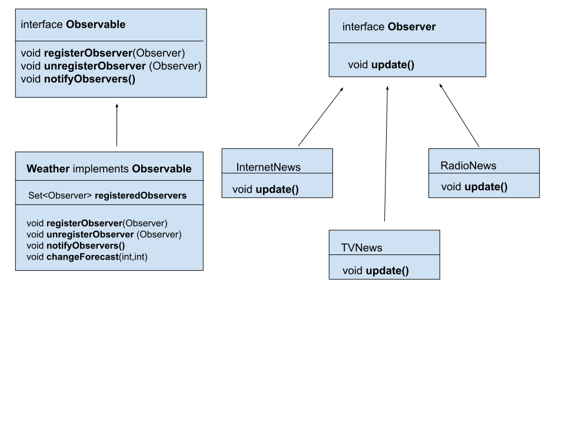

# Introduction
The **Observer** design pattern is the answer to the problem of tracking changes in an object of a given class. The object to be tracked must implement the **Observable** interface. Objects that will track this object must implement the **Observer** interface. In addition, for everything to work properly, tracking objects must be added to the tracked object as registered observers. Now, when the state of the object changes, they will be immediately informed and will be able to perform some actions related to it.


# Flow diagram
We can distinguish two parts in the diagram.

[Internet News](/Basics/src/main/java/observable/Observable.java "Title")

The first part contains classes related to the ***observed object***.
The **Observable** interface is the most important here. It defines three methods for managing observers
- ````registerObserver(Observer observer)```` this method registers a new observer
- ````unregisterObserver(Observer observer)```` this method unregister an existing observer
- ````notifyObservers()```` this method informs all registered observers that the state of the observed object has been changed

The **Observable** interface will be implemented by a specific class, whose object state will be observed.
In our case, class **Weather** will be observed class. That is why we can see that this class implements all three **Observable** interface method.
Beside there must to be a mathod, in our case **changeForecast(int,int)**, which will change to object's state.
In this method, we can call a method ````notifyObservers()```` of implemented interface.

````java
public void changeForecast(int temperature, int pressure){
       this.temperature=temperature;
       this.pressure=pressure;
       notifyObservers();
    }
````
As you can see, the **Weather** class keeps registered observators in **registeredObservers** set.


The second part of diagram are the classes connected to observing objects. You can see the **Observer** interface which has one method **update(Weather weather)**

If a class wants to observe changes in the **Weather** class, it must  implement the **update** method.
In the picture you can see that three classes implement this method. That class are **InternetNews**, **RadioNews**, **TVNews**.
Only these classes will receive notification about the changes in weather state, provided that their objects will be added to registered observers in the Weather class.
When the objects receive notifications about a state change in the ** Weather ** class object, they will call their **update** method and can do what they have to.
For example, they display the information about a change in the state of the object
```java
public class TVNews implements Observer {
    @Override
    public void update(Weather weatherForecast) {
        logger.info("TV - "+weatherForecast);
    }
}

```
# Benefits and disadvantages using Observer pattern

The benefits are
1. The class which implements the Observer interface does not have to check if the object has changed.
2. The observed object can notify a lot of observers using the same method.

The main disadvantegs are:
1. The observer notified about changed status have to check what has changed in the observed object.
2. When synchronizing notifying observers, there may be a situation in which calls to the **update** method take a large part of the time.

# When Observer pattern can be applied
We use the Observer pattern when we want to receive a notification about the change of status of the object we are observe.

# Occurrence
1. We can see very often **Observer** as **EventListener**. This is the basic interface for interfaces that are used to inform about the occurrence of an event.
2. When you want to use **Observer** pattern in creating threads, you must remember that thread waiting for a resource is notified when the resource is available.
3. You can use **Observer** pattern in mvc pattern : the view observes changes in the model, the model notifies the view about changes that should be displayed on view .

# Sample article
https://www.baeldung.com/java-observer-pattern

# Youtube
[](http://www.youtube.com/watch?v=v9ejT8FO-7I)