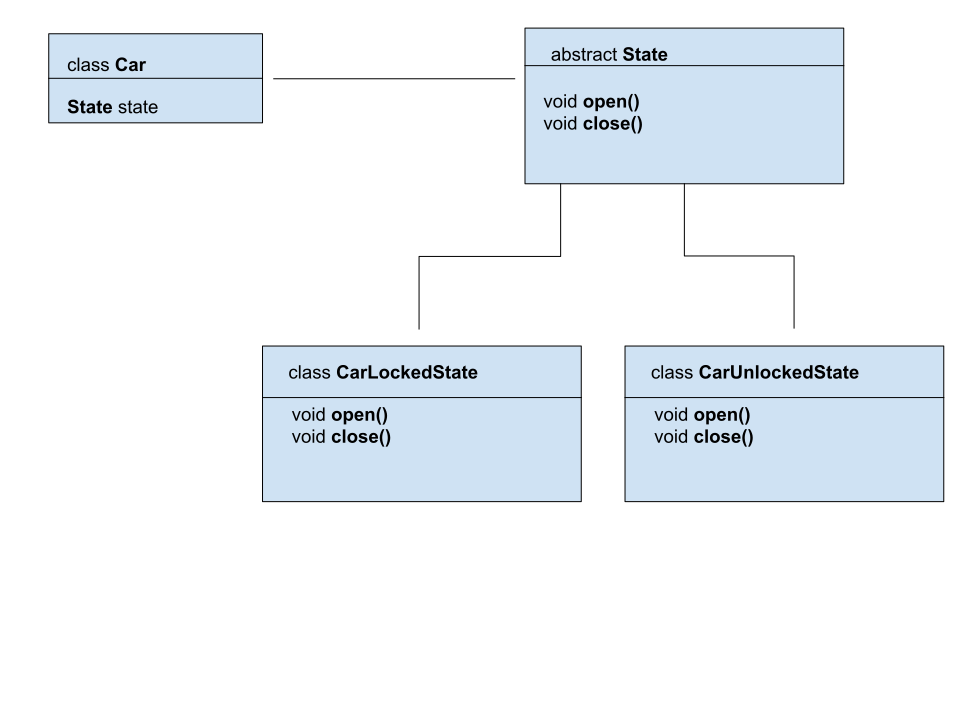

# Introduction
The **State pattern** makes the behavior of the object dependent on the state of the object. The **State pattern** puts all behavior associated with a particular state into one object. 
Because all state-specific code are located in a State subclass, new states and transitions can be added easily by defining new subclasses.

````

public interface State {
    void startEngine(Car car);

    void stopEngine(Car car);

    void open(Car car);

    void close(Car car);

    void startDriving(Car car);

    void stopDriving(Car car);

}
````
It makes state transitions explicit.
When an object defines its current state only in terms of internal data values, its state transitions have no explicit representation. 
They only show up as assignments to some variables. Introducing separate objects for different states makes the transitions more explicit.
Also, State objects can protect the Context from inconsistent internal states, because state transitions are atomic from the Context's perspective - they happen by rebinding one variable (the Context's State object variable), not several.

State objects can be shared. If State objects have no instance variables - that is, the state they represent is encoded entirely in their type - then contexts can share a State object. When states are shared in this way, they are essentially flyweights with no intrinsic state, only behavior.

# Flow diagram


The diagram shows the **State interface**, with methods to be implemented. The example concerns how to handle a car.

````
public class EngineStartedState extends BaseLogger implements State {

    @Override
    public void startEngine(Car car) {
        logger.info(ALREADY_STARTED_ENGINE.getDescription());
    }

    @Override
    public void stopEngine(Car car) {
        logger.info(JUST_STOPPED_ENGINE.getDescription());
        car.state = new EngineNotStartedState();
    }

    @Override
    public void open(Car car) {
        logger.info(ALREADY_UNLOCKED.getDescription());
    }

    @Override
    public void close(Car car) {
        logger.info(HAVE_TO_STOP_ENGINE.getDescription());
    }

    @Override
    public void startDriving(Car car) {
        logger.info(JUST_START_DRIVING.getDescription());
        car.state = new StartedDrivingState();
    }

    @Override
    public void stopDriving(Car car) {
        logger.info(HAVE_TO_START_DRIVING.getDescription());
    }
}
````
For example: a car that is already opened and the engine is already running is ready to start. This means that it is able to start engine. 
This state id described as **EngineStartedState**. This is described in the class above.
However, if we stop the engine, the car will not be able to start.
It will then be in the **EngineNotStarted** state - this state is described by the **EngineNotStartedState** class

````
public class EngineNotStartedState extends BaseLogger implements State {

    @Override
    public void startEngine(Car car) {
        logger.info(JUST_STARTED_ENGINE.getDescription());
        car.state = new EngineStartedState();
    }

    @Override
    public void stopEngine(Car car) {
        logger.info(HAVE_TO_START_ENGINE.getDescription());
    }

    @Override
    public void open(Car car) {
        logger.info(ALREADY_UNLOCKED.getDescription());
    }

    @Override
    public void close(Car car) {
        logger.info(JUST_LOCKED.getDescription());
        car.state = new CarLockedState();
    }

    @Override
    public void startDriving(Car car) {
        logger.info(HAVE_TO_START_ENGINE.getDescription());
    }

    @Override
    public void stopDriving(Car car) {
        logger.info(HAVE_TO_START_DRIVING.getDescription());
    }
}
````

# Benefits and disadvantages using Factory pattern
## Benefits
Major advantage of the state model is its capability to minimize conditional complexity. 
It eliminates the need for it and switches statements on objects with different behavioral requirements, unique to different state transitions.
So, representing an object’s state using a finite state machine diagram simplifies the conversion of the diagram into a state design model’s types & methods.

## Disadvantages
A developer needs to write a large amount of code for the state schema. Depending on the number of different defined state transition methods and possible object states, you can write several methods.

# When Factory pattern can be applied
An object with a relatively complex set of possible states applies the state model. Especially applied for an object with multiple business rules on how state transitions occur and what happens next.
In addition, you can update any state at any time with a special logic if the object is only a state-owned property. This increases a needless complication in the State Schema. 
However, for the objects representing real-world concepts, with a compound workflow, state structure can be a proper option.

# Occurrence
We can find **State Pattern** in javax.faces.lifecycle.LifeCycle#execute() (controlled by FacesServlet, the behaviour is dependent on current phase (state) of JSF lifecycle)

# Sample article
https://www.baeldung.com/java-state-design-pattern

# Youtube
[](http://www.youtube.com/watch?v=MGEx35FjBuo)