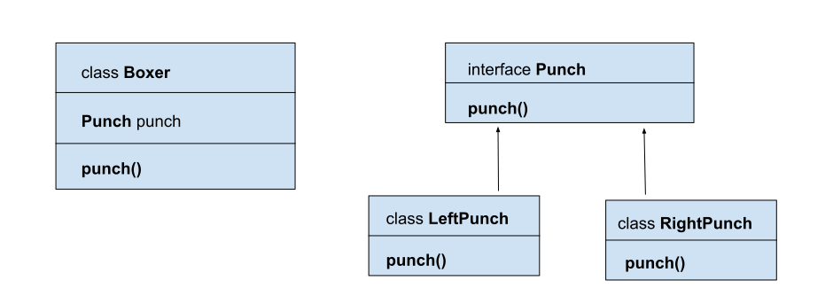

# Introduction
**The strategy pattern** allows us to change the behavior of an algorithm at runtime.
We start with an interface which is used to apply an algorithm, and then implement it multiple times for each possible algorithm.

# Flow diagram

# Benefits and disadvantages using Strategy pattern
## Benefits
- prevents from using the conditional statements
- we can change an algorithm method during a runtime 
- extendable in easy way.

## disadvantages
- users of you app must know about existence of different strategies (algorithms) and they must understand how the strategies differ
- it increases the number of objects in your app.

# When Strategy pattern can be applied
The **Strategy** pattern can be used when we need to use various algorithms in an application to serve a specific services.
For example, if we need to apply different price discounts in an online store depending on the date or other factors.
# Occurrence
We can find **Strategy pattern** in:
java.util.Comparator#compare(), executed by among others Collections#sort().
javax.servlet.http.HttpServlet, the service() and all doXXX() methods take HttpServletRequest and HttpServletResponse and the implementor has to process them (and not to get hold of them as instance variables!).
javax.servlet.Filter#doFilter()
Layout Managers in AWT/Swing are an example of Strategy

# Sample article
https://www.baeldung.com/java-strategy-pattern

# Youtube
