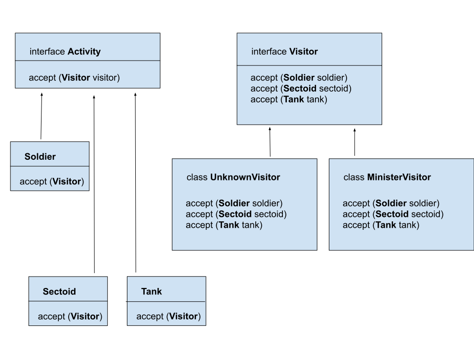

# Introduction
The purpose of a **Visitor pattern** is to define a new operation without introducing the modifications to an existing object structure.
Imagine that we have a composite object which consists of components. The object's structure is fixed – we either can't change it, or we don't plan to add new types of elements to the structure.
Now, how could we add new functionality to our code without modification of existing classes?
The **Visitor design pattern** can be an answer. All we have to do is to add a method which accepts the visitor class to each element of the structure.
That way our components will allow the visitor implementation to **visit** them and perform any specific action on that element.
We can say, we'll extract the algorithm which will be applied to the object structure from the classes.
In addiction we'll make good use of the Open/Closed principle as we won't modify the code, but we'll still be able to extend the functionality by providing a new Visitor implementation.

# Flow diagram



**interface Visitor**
```

public interface Visitor {
    int visit(Sectoid sectoid);

    int visit(Soldier soldier);

    int visit(Tank tank);
}
```

**interface Activity**
```
public interface Activity {
    int accept(Visitor visitor);
}
```

**Concrete class of Visitor**
```
public class MinisterOfDefenseVisitor extends BaseLogger implements Visitor {
    private String name;

    public MinisterOfDefenseVisitor(String name) {
        this.name = name;
    }

    @Override
    public int visit(Sectoid sectoid) {
        int power = sectoid.getArmor();
        logger.info(SECTOID_VISITED_BY.getInfo() + name);
        if (sectoid.getWeapon().equals("Heavy Plasma")) power += power << 1;
        return power;
    }

    @Override
    public int visit(Soldier soldier) {
        int power = soldier.getHealth();
        logger.info(SOLDIER_VISITED_BY.getInfo() + name);
        if (soldier.getWeapon().equals("Pistol")) power = power + 10;
        return power;
    }

    @Override
    public int visit(Tank tank) {
        int power = tank.getArmour();
        logger.info(TANK_VISITED_BY.getInfo() + name);
        if (tank.getWeapon().equals("Heavy Plasma")) power += power << 3;
        return power;
    }
}
```
method accept in class Tank implement Activity looks like below
```
 @Override
    public int accept(Visitor visitor) {
        return visitor.visit(this);
    }
```
# Benefits and disadvantages using Visitor pattern
## Benefits
**Visitor pattern** makes adding new operations easy. Visitors make it easy to add operations that depend on the components of complex objects. 
You can define a new operation over an object structure simply by adding a new visitor. In contrast, if you spread functionality over many classes, then you must change each class to define a new operation.
A visitor gathers related operations and separates unrelated ones. Related behavior isn't spread over the classes defining the object structure. It is localized in a visitor. Unrelated sets of behavior are partitioned in their own visitor subclasses. That simplifies both the classes defining the elements and the algorithms defined in the visitors. Any algorithm-specific data structures can be hidden in the visitor.

**Visitor** can visit objects that don't have a common parent class. You can add any type of object to a Visitor interface.
**Visitors** can accumulate state as they visit each element in the object structure. Without a visitor, this state would be passed as extra arguments to the operations that perform the traversal, or they might appear as global variables.

## Disadvantages
**Visitor's** approach assumes that the Element interface is powerful enough to let visitors do their job. As a result, the pattern often forces you to provide public operations that access an element's internal state, which may compromise its encapsulation.
Adding new Element classes is hard. The Visitor pattern makes it hard to add new subclasses of Element. Each new ConcreteElement gives rise to a new abstract operation on Visitor and a corresponding implementation in every ConcreteVisitor class. Sometimes a default implementation can be provided in Visitor that can be inherited by most of the ConcreteVisitors, but this is the exception rather than the rule.

# When Visitor pattern can be applied
You apply the **Visitor pattern** when you are mostly likely to change the algorithm applied over an object structure or the classes of objects that make up the structure. The Visitor class hierarchy can be difficult to maintain when new ConcreteElement classes are added frequently. In such cases, it's probably easier just to define operations on the classes that make up the structure. If the Element class hierarchy is stable, but you are continually adding operations or changing algorithms, then the Visitor pattern will help you manage the changes.

# Occurrence
We can find **Visitor Pattern** in
- javax.lang.model.element.AnnotationValue and AnnotationValueVisitor
- javax.lang.model.element.Element and ElementVisitor
- javax.lang.model.type.TypeMirror and TypeVisitor
- java.nio.file.FileVisitor and SimpleFileVisitor
- javax.faces.component.visit.VisitContext and VisitCallback

# Sample article
https://www.baeldung.com/java-visitor-pattern

# Youtube

[](http://www.youtube.com/watch?v=pL4mOUDi54o)